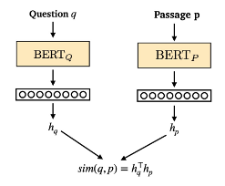

### 모델 설명

- Bi-encoder 기반의  DPR 모델을 `klue/roberta-base`(https://huggingface.co/klue/roberta-base) 모델로 구현한 코드입니다. ([참고 레포지토리](https://github.com/TmaxEdu/KorDPR))
- 이 모델은 질문이 들어왔을 때 관련있는 상법 조항을 검색할 수 있도록 구성되어 있습니다.
- Bi-encoder architecture : DPR 모델은 두 인코더 모델을 활용하여 query와 passage를 각각 인코딩하고 cls 토큰의 dot product를 통해 유사도를 측정합니다. 관련있는 passage와의 유사도를 높이는 방향으로 학습합니다.
    
    
    
- 해당 코드는 24G RTX4500 에서 돌아가는 것을 확인하였습니다. 현재 배치 사이즈는 16이나, 배치 사이즈를 이보다 키울 경우 학습 성능과 속도에서 이득을 볼 수 있으나  더 큰 메모리의 GPU 자원이 필요합니다.

### How To Run

1. 필요한 패키지를 다운받습니다.

```python
pip install -r requirements.txt
```

2. DPR finetuning 을 진행합니다. 

```python
python trainer.py
```

- input
    - train dataset : `dataset/train_with_id.csv`
    - dev dataset : `dataset/dev_with_id.csv`
- output
    - `legal_dpr.pt`
    - `legal_dpr_optim.pt`

3. 학습된 모델을 기반으로 faiss index를 생성합니다.

```python
python indexers.py
```

- input
    - `legal_dpr.pt`
    - `legal_dpr_optim.pt`
    - index하여 저장하고자 하는 passage dataset : `dataset/sangbub_jo_prompt.json`
- output
    - `legal_dpr.index`

4. 학습된 모델에서 query embedding을 생성하고, 미리 저장해놓은 faiss index (passage index vector storage)에서 가장 유사한 값을 검색합니다.

```python
python retriever.py
```

- input
    - `legal_dpr.pt`
    - `legal_dpr_optim.pt`
    - `legal_dpr.index`
    - test dataset : `dataset/test_with_id.csv`
- output
    - 검색 결과 파일이 `retrieval_results` 에 저장됨
- confing_dict에서 ‘top_k’를 조절해가며 검색할 수 있습니다.
    
    
    

5. `evaluate_search_result.ipynb` 을 통하여 검색된 결과의 성능을 평가합니다. 
    
    
    
    - 3epoch 학습시켰을 때의 결과